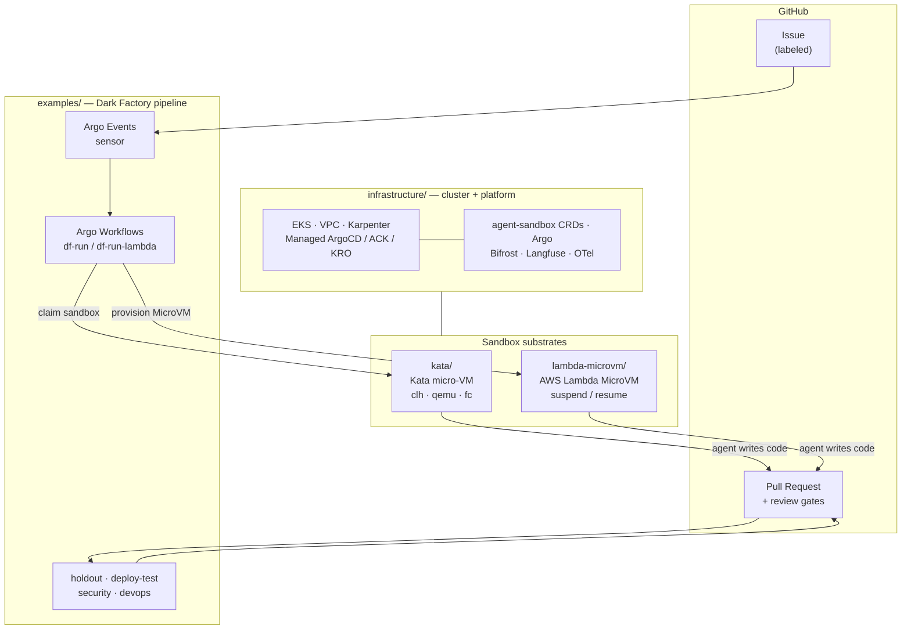

<div align="center">

# Agent Sandbox Blueprints

**Run autonomous coding agents in hardware-isolated sandboxes on Amazon EKS.**

A GitHub issue goes in. A reviewed, tested, merged pull request comes out — written by an AI agent
running inside a micro-VM it cannot escape.

[](LICENSE)
[](https://aws.amazon.com/eks/)
[](https://katacontainers.io/)
[](https://aws.amazon.com/lambda/)

</div>

---

## Overview

**Agent Sandbox Blueprints** is a minimal, runnable blueprint for the **Dark Factory** pattern: an
autonomous coding agent that takes a GitHub issue, implements it, tests it, gets it reviewed, and
merges it — with a human approving *evidence*, not diffs.

The agent runs untrusted, LLM-generated code, so it never runs in a shared-kernel container. This
blueprint gives you **two hardware-isolated substrates** for it, behind one identical developer
experience:

| Substrate | What it is | Best for |
|---|---|---|
| **Kata micro-VM** | Hardware-isolated pods on nested-virt EKS nodes — your own kernel per sandbox, three hypervisors (Cloud Hypervisor, QEMU, Firecracker) | Production-ready today; long-lived workspaces; GPU (via QEMU) |
| **AWS Lambda MicroVM** | Serverless Firecracker VMs provisioned on demand, suspended while idle, terminated at merge | Bursty agent work; scale-to-zero economics; no node pool to operate |

Pick one, or run both side by side. **The pipeline, review gates, and UX are identical** — the only
difference is a label on the GitHub issue.

> **Why this repo exists.** These pieces exist inside a larger platform, buried under fleet
> management, multi-cluster GitOps, and a dozen addons. This is the same outcome with the fewest
> moving parts: **one cluster, one ArgoCD, one command.**

---

## Architecture

Three layers. Each is independently deployable, and each folder in this repo maps to one.



**The flow:** label an issue → a sandbox is created → the agent clones, implements, tests, and opens
a PR → automated gates review it (hidden-scenario holdout, `terraform validate`/deploy test, security
and DevOps reviewers) → a human approves → it merges and the sandbox is destroyed.

On **Lambda MicroVM**, the VM is *suspended* for the entire review window and *resumed* only when a
fix is requested — you pay for the minutes the agent is actually thinking.

---

## Repository layout

```
infrastructure/     Terraform (VPC, EKS, Karpenter, Managed ArgoCD/ACK/KRO) + GitOps addons
kata/               Kata substrate: 3 VMMs, nested-virt Karpenter pools, sandbox templates
lambda-microvm/     Lambda MicroVM substrate: ACK controller, KRO graph, hook-server image, shim
examples/
  dark-factory-kata/    Run the pattern on Kata
  dark-factory-lambda/  Run the pattern on Lambda MicroVM
docs/               Architecture, substrate comparison, diagrams, prerequisites, troubleshooting
```

---

## Getting Started

### Prerequisites

- An AWS account in **`us-west-2`** (AWS Lambda MicroVM availability — see [PREREQUISITES](docs/PREREQUISITES.md))
- `terraform` ≥ 1.7, `kubectl`, `aws` CLI v2, [`task`](https://taskfile.dev), `helm`, `gh`
- **EKS Managed capabilities enabled** in your account: ArgoCD, ACK, KRO
- A GitHub repo the agent will work in, and a token — **never committed** (see [secrets](docs/PREREQUISITES.md#secrets))

### 1 — Configure (nothing real is committed)

```bash
cp infrastructure/terraform/example.tfvars infrastructure/terraform/terraform.tfvars
cp infrastructure/gitops/values.example.yaml infrastructure/gitops/values.yaml
# edit both — region, cluster name, your GitOps repo URL
```

### 2 — Create the cluster and platform

```bash
task up          # terraform apply → EKS + Karpenter + Managed ArgoCD/ACK/KRO, then bootstrap addons
```

### 3 — Add a substrate (either or both)

```bash
task kata        # nested-virt Karpenter pools + kata-deploy (clh/qemu/fc) + sandbox templates
task lambda      # lambdamicrovms ACK controller + KRO graph + hook-server image + shim bridge
```

### 4 — Run the Dark Factory

```bash
cp examples/dark-factory-kata/values.example.yaml examples/dark-factory-kata/values.yaml
# edit: target repo, PAT secret, trigger label, model
task demo-kata      # or: task demo-lambda
```

Then register the GitHub webhook ([MANUAL-STEPS.md §2](docs/MANUAL-STEPS.md) — one
manual step, because the address does not exist until the cluster does), label an
issue, and watch the PR appear. Full walkthroughs:
[Kata](examples/dark-factory-kata/README.md) · [Lambda MicroVM](examples/dark-factory-lambda/README.md)

### Tear down

```bash
task down        # destroys everything, including the sandboxes and node pools
```

---

## Choosing a substrate

| | Kata micro-VM | Lambda MicroVM |
|---|---|---|
| **Isolation** | Own kernel per sandbox (VT-x) | Own kernel per sandbox (Firecracker) |
| **Provisioning** | Pre-warmed pool → instant claim | On-demand, ~90 s cold start |
| **Scale to zero** | Node pool consolidates when idle | **VM suspends between rounds** |
| **Persistent workspace** | ✅ Volume-backed | ❌ Read-only rootfs (`/tmp` only) |
| **GPU** | ✅ via `kata-qemu` (VFIO) | ❌ |
| **Maturity** | Production-ready | Preview / pre-GA |

Full comparison, benchmark timings, and the VMM capability matrix:
**[docs/SUBSTRATES.md](docs/SUBSTRATES.md)**

---

## Documentation

| Doc | What's in it |
|---|---|
| [ARCHITECTURE.md](docs/ARCHITECTURE.md) | The three layers, CRDs, and how the pipeline drives a sandbox |
| [SUBSTRATES.md](docs/SUBSTRATES.md) | Kata vs Lambda MicroVM; VMM capability matrix; benchmarks |
| [DIAGRAMS.md](docs/DIAGRAMS.md) | Sequence and flow diagrams for every lifecycle |
| [PREREQUISITES.md](docs/PREREQUISITES.md) | Accounts, quotas, region, GitHub setup, **cost estimate** |
| [MANUAL-STEPS.md](docs/MANUAL-STEPS.md) | The few things not automated, and why each one cannot be |
| [ROADMAP.md](docs/ROADMAP.md) | What's next, and the **known gaps** you will hit |
| [TROUBLESHOOTING.md](docs/TROUBLESHOOTING.md) | Every gotcha we hit, and the fix |
| [ROADMAP.md](docs/ROADMAP.md) | What's next, known limitations |

---

## Contributing

Contributions welcome — see [CONTRIBUTING.md](CONTRIBUTING.md).

## Security

Found a security issue? See [SECURITY.md](SECURITY.md). Do not open a public issue.

## License

Licensed under the [MIT-0](LICENSE) License.

## Contact

Maintained by [@elamaran11](https://github.com/elamaran11). Questions and feedback via
[GitHub Issues](../../issues).
